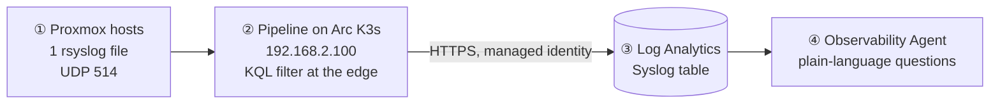

# 15-minute demo: Azure Monitor pipeline + Observability Agent

**Story:** *Devices that can't run an agent send plain syslog → a pipeline at the edge filters it → Log Analytics →
you ask questions in plain language.*



| Time | Part | Where |
|---|---|---|
| 0:00–1:30 | Why: edge devices, cost, no agents | this diagram |
| 1:30–4:30 | **① Proxmox host setup**, live packet | Proxmox shell |
| 4:30–8:00 | **② Azure setup**: pipeline, dataflow, edge filter | Azure portal |
| 8:00–13:30 | **③④ Data and Observability Agent prompts** | Log Analytics |
| 13:30–15:00 | Wrap-up: GA vs preview, questions | — |

---

## ⏱️ Before the demo (T-60 min checklist)
- [ ] Pipeline healthy: `kubectl -n azure-monitor-ns get pods`; `amp-portal-demo-statefulset-0` shows **3/3**
- [ ] Data fresh: `Syslog | where TimeGenerated > ago(15m) | count` > 0 in `law-amp-lab`
- [ ] **Send the live-demo message now** (ingestion takes 2–5 min, too slow to wait for during a 15-min demo):
      `logger -p auth.notice -t amp-demo "demo message from $(hostname)"` on host01
- [ ] Observability Agent button visible in *law-amp-lab → Logs* (needs Azure Copilot access); **run each prompt once**
- [ ] Browser tabs open, in order: ① Proxmox host01 → Shell · ② pipeline `amp-portal-demo` · ② DCR `Aep-amp-portal-demo-*` · ③ `law-amp-lab` → Logs
- [ ] Rehearse what's on screen: raw syslog shows hostnames and `root`; agent answers vary

---

## ① Proxmox host setup (3 min)

**Message:** *one file, no agent, no Azure credentials on the host.*

Proxmox UI → **host01 → Shell**:

```bash
cat /etc/rsyslog.d/90-amp-lab.conf
```
```text
# amp-lab: forward to Azure Monitor pipeline (remove file to undo)
*.info;auth,authpriv.* action(type="omfwd" target="192.168.2.100" port="514" protocol="udp" template="RSYSLOG_SyslogProtocol23Format")
```

| Part | Say |
|---|---|
| `*.info;auth,authpriv.*` | "Everything at info and above, plus every login and sudo event." |
| `omfwd` → `192.168.2.100` | "rsyslog's built-in forwarder sends to the pipeline endpoint." |
| `port="514" protocol="udp"` | "Standard syslog port. Any switch, firewall or appliance can do this." |
| `RSYSLOG_SyslogProtocol23Format` | "RFC 5424, which matches the dataflow's format setting in Azure." |

**Live: watch it leave the host.** Open **two shells on the same host** (e.g. two browser tabs with
Proxmox → host01 → **Shell**, side by side; the Proxmox shell is already root).

**Shell 1** (start first; it keeps running):
```bash
tcpdump -l -nni enp88s0 -A "udp port 514 and dst host 192.168.2.100" | grep --line-buffered -B1 amp-demo
```
**Shell 2:**
```bash
logger -p auth.notice -t amp-demo "live demo from $(hostname)"
```
→ Shell 1 shows (tested on both hosts):
```text
13:26:02.390489 IP 192.168.2.170.54666 > 192.168.2.100.514: SYSLOG auth.notice, length: 84
E..pq.@.@.C........d.....\..<37>1 2026-10-05T13:26:02.390379+02:00 host01 amp-demo - - -  live demo from host01
```
Point at: **destination `192.168.2.100.514`**, **UDP/SYSLOG**, `auth.notice`, and the raw **RFC 5424** line (`<37>1 …`).
Stop shell 1 with **Ctrl+C**.

> Why `enp88s0` and not `vmbr0`: both hosts route to .100 via their **second NIC** (`enp88s0`, host01 = .170,
> host02 = .172). On `vmbr0`, host02 shows nothing and host01 only shows the payload line.
> `-l` + `grep -B1` keep the header line with the destination port visible.

**Optional, to show the filter:** `logger -p user.debug -t amp-demo "debug: dropped at the edge"` is visible here
but will **never** reach Azure.

> Note: the source address is **.170 / .172** (second NIC), not the .160/.161 management IP. Linux picks the outgoing interface itself.

---

## ② Azure setup (3.5 min)

**Message:** *Azure manages the pipeline like any resource; it runs in my network.*

1. **Monitor → Azure Monitor pipelines → `amp-portal-demo`** (or the Arc cluster `arc-amp-lab` → Extensions)
   - Runs on **Arc-enabled K3s** (VM 110), extension `azmon-pipeline-extension` 1.7.0
   - Custom location `azure-monitor-arc-amp-lab` → namespace `azure-monitor-ns`
2. **Dataflow** `default-syslog`: port **514 / UDP**, formats 5424 + 3164 → table **Syslog** in `law-amp-lab`
3. **Edge transformation** (the cost lever). This runs *on the VM, before upload*:
   ```kusto
   source
   | where SeverityLevel != 'debug'
   | where ProcessName !in ('pvestatd', 'CRON', 'systemd-timesyncd', 'postfix')
   ```
   Say: *"postfix used to produce ~2,500 lines a day here. Now it's never sent, never billed."*
   It's a filter that runs inside the pipeline on your own hardware, before anything is sent to Azure. It drops every debug-level message, plus everything from four noisy background processes: Proxmox status polling (pvestatd), scheduled jobs (CRON), clock sync (systemd-timesyncd) and mail (postfix). Only the remaining records reach Log Analytics, so the noise never leaves your network and is
    never billed.
5. **DCR `Aep-amp-portal-demo-*` → Monitoring → Metrics**: *Rows Received* (proof that data crosses the edge → cloud hop).
   Access control: only the pipeline's **managed identity** can publish here, so there are no secrets on the edge.

---

## ③④ Data and Observability Agent (5.5 min) ⭐

Open **`law-amp-lab` → Logs**.

**③ Proof (30 s):** run the KQL, show the live message:
```kusto
Syslog
| where ProcessName == "amp-demo"
| project TimeGenerated, Computer, Facility, SeverityLevel, SyslogMessage, CollectorHostName
```
→ Raw text from the host is now structured columns. `CollectorHostName = amp-portal-demo` = came through the pipeline.

**④ Click *Observability Agent*.** Say: *"Same data, but now I just ask."*

| # | Prompt (copy-paste) | What it shows | KQL fallback |
|---|---|---|---|
| 1 | *Summarize the Syslog table in this workspace for the last 24 hours by computer and severity. Is anything unusual?* | Instant overview of edge data | `Syslog \| where TimeGenerated > ago(24h) \| summarize count() by Computer, SeverityLevel` |
| 2 | *In the Syslog table of this workspace, are there any records with ProcessName postfix in the last 30 minutes? I expect none because they're filtered at the edge.* | **Proves the edge filter**, in plain language | `Syslog \| where TimeGenerated > ago(30m) \| where ProcessName == 'postfix' \| count` |
| 3 | *From the Syslog table in this workspace, show auth/authpriv, sshd and sudo activity per computer for the last 24 hours. Are there failed login attempts in the messages?* | Security value of host logs | `Syslog \| where TimeGenerated > ago(24h) \| where Facility in ('auth','authpriv') or ProcessName in ('sshd','sshd-session','sudo') \| summarize count() by Computer, ProcessName` |
| 4 ⭐ | *In the Syslog table of this workspace, only for CollectorHostName amp-portal-demo in the last 24 hours: which processes produce the most records? Suggest which ones I could filter at the edge to reduce ingestion cost.* | **Closes the loop**: AI suggests → you add it to the edge transform | `Syslog \| where TimeGenerated > ago(24h) \| where CollectorHostName == "amp-portal-demo" \| summarize count() by ProcessName \| top 10 by count_` |
| + | *Show the KQL you used.* | Transparency; it's the same KQL your team would write | — |

**If time is short:** do prompts **2** and **4** only.

**Key line:** *"The pipeline isn't a silo. Once data lands in Log Analytics, every Azure Monitor capability works on it,
including the agentic ones."*

---

## Wrap-up (1.5 min)
| Point | Say |
|---|---|
| Maturity | Syslog/CEF = **GA**; OTLP logs and the Observability Agent = **preview** |
| Scope | Pipeline = **logs** only. Metrics go through Managed Prometheus (separate path) |
| Operating model | Microsoft manages the pipeline; **you** run the Kubernetes cluster |
| Production | TCP+TLS instead of UDP, persistent buffer for outages, multiple nodes |

## Likely questions
| Q | A |
|---|---|
| Encrypted? | Lab: plaintext UDP. Production: TCP + TLS (rsyslog `gtls`, pipeline TLS + gateway) |
| Pipeline down? | UDP: lost. TCP + rsyslog queue: the host buffers; pipeline persistent storage buffers up to 48 h |
| Host needs internet/Azure creds? | No. Only the pipeline goes outbound (HTTPS, managed identity) |
| More sources? | Same IP/port, no pipeline change |
| Cost? | Pay for what's ingested; the edge filter cuts it before it's billed |
| Does the agent see other data? | It runs with **your** RBAC. Prompts here are scoped to this workspace's Syslog table |

## Fallbacks
| If… | Then |
|---|---|
| Agent button missing or slow | Run the KQL fallback column; say the agent is preview |
| Live message not in LAW yet | Show the one sent at T-60; explain the 2–5 min ingestion latency |
| tcpdump shows nothing | Check you used `enp88s0` (not `vmbr0`); run `logger` again; `systemctl is-active rsyslog` |

Full background: `docs/PORTAL-SETUP.md` (setup + Part E prompts), `docs/LEARN.md` (concepts).
