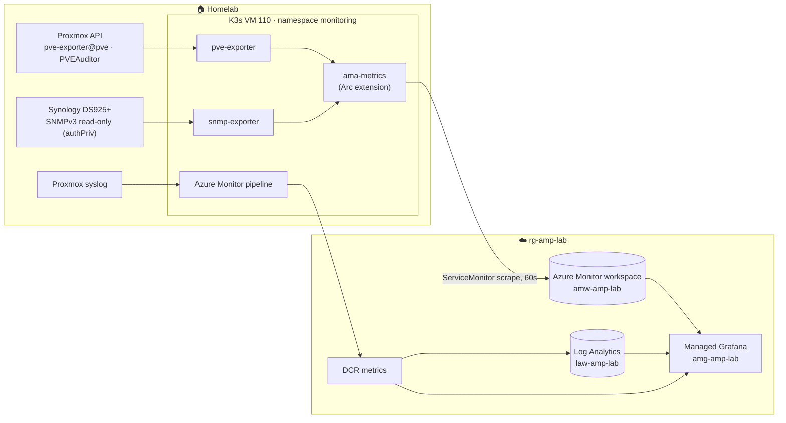

# Homelab health dashboard: Azure Managed Grafana

One dashboard for the demo: **Proxmox cluster + Synology NAS health** (metrics) and **syslog events**
(from the Azure Monitor pipeline), all in Azure Managed Grafana.



## Dashboard: *Homelab health – Azure Monitor demo* (`grafana/homelab-health.json`)

| Row | Panels | Source |
|---|---|---|
| 🖥️ Proxmox cluster | quorum, nodes up, guests running/stopped, guests without backup, node CPU/RAM, storage per pool, guest status timeline (by **VMID**) | `pve-exporter` |
| 💾 Synology NAS | system/power/fans, volume status and usage, system and disk temperature, disks healthy, network throughput | `snmp-exporter` |
| 📜 Events | syslog volume per host, auth/privilege events, warnings and errors | Log Analytics (pipeline) |
| ⚙️ Pipeline health | DCR rows received/dropped, metric scrape targets up | DCR metrics, Prometheus |

## Demo-safe choices
- **Guests by VMID only:** the exporter's `name`, `template` and `tags` labels are dropped at scrape time
  (`metricRelabelings` in `k8s/monitoring/pve-exporter.yaml`), so they never reach Azure.
- **NAS health only:** the SNMP module is trimmed to system, disk, RAID and interface metrics. Serial numbers, disk models,
  iSCSI LUN names, service users and share names aren't collected. **No NAS syslog** (file and connection logs contain
  usernames, filenames and IP addresses).
- **Rehearse:** the *Warnings & errors* and *Auth* panels show raw Proxmox syslog lines (hostnames,
  usernames such as `root`). Check them before going on screen, or collapse the Events row.

## Components and access

| Item | Value |
|---|---|
| Grafana | `amg-amp-lab`, **Standard X1** (Essential can't be created anymore), Grafana 12 |
| Grafana identity | Monitoring Reader / Monitoring Data Reader / Log Analytics Reader, **scoped to `rg-amp-lab`** (the subscription-wide default was removed) |
| Your access | Grafana Admin on `amg-amp-lab` |
| Metrics extension | `azuremonitor-metrics` (`Microsoft.AzureMonitor.Containers.Metrics`) on `arc-amp-lab` |
| Proxmox | user `pve-exporter@pve`, role **PVEAuditor** at `/`, API token `metrics`. Secret `monitoring/pve-exporter` |
| NAS | SNMPv3 user `amp-snmp`, SHA + AES, v1/v2c disabled. Secret `monitoring/snmp-nas` |
| VM 110 tweak | `/etc/sysctl.d/90-k3s-inotify.conf` (`max_user_instances=1024`). Without it `ama-metrics-operator-targets` crashes with *too many open files* |

## Cost (West Europe list prices, Oct 2026)
| Item | ≈ per month |
|---|---|
| Managed Grafana Standard X1 (2 × $0.043/h) + 1 active user ($6) | **~$69** (~$2.30/day) |
| Managed Prometheus ingestion ($0.16 / 10M samples) | ~$5–15 |
| Log Analytics (pipeline syslog) | < $1 |
| **Total** | **~$75–85** while Grafana exists |

👉 Grafana is the main cost. **Delete it after the demo** and re-create it from this repo when needed:
```bash
az grafana delete -n amg-amp-lab -g rg-amp-lab -y
```

## Rebuild
```bash
az monitor account create -n amw-amp-lab -g rg-amp-lab -l westeurope
az grafana create -n amg-amp-lab -g rg-amp-lab -l westeurope --sku-tier Standard
az k8s-extension create -n azuremonitor-metrics --cluster-name arc-amp-lab -g rg-amp-lab --cluster-type connectedClusters \
  --extension-type Microsoft.AzureMonitor.Containers.Metrics \
  --configuration-settings azure-monitor-workspace-resource-id=<amw-id> grafana-resource-id=<amg-id>
kubectl apply -f k8s/monitoring/            # after creating Secrets pve-exporter and snmp-nas
az grafana dashboard import -n amg-amp-lab -g rg-amp-lab --definition grafana/homelab-health.json --overwrite true
```

## Remove the homelab-side access afterwards
```bash
ssh host01 'pveum user delete pve-exporter@pve'                       # also removes the token and ACL
# NAS: Control Panel → Terminal & SNMP → SNMP → disable (or synowebapi SYNO.Core.SNMP set enable_snmp=false)
kubectl delete ns monitoring
```
