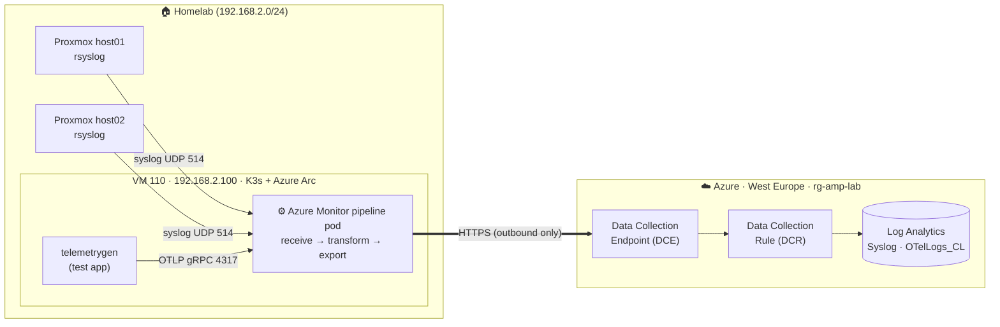
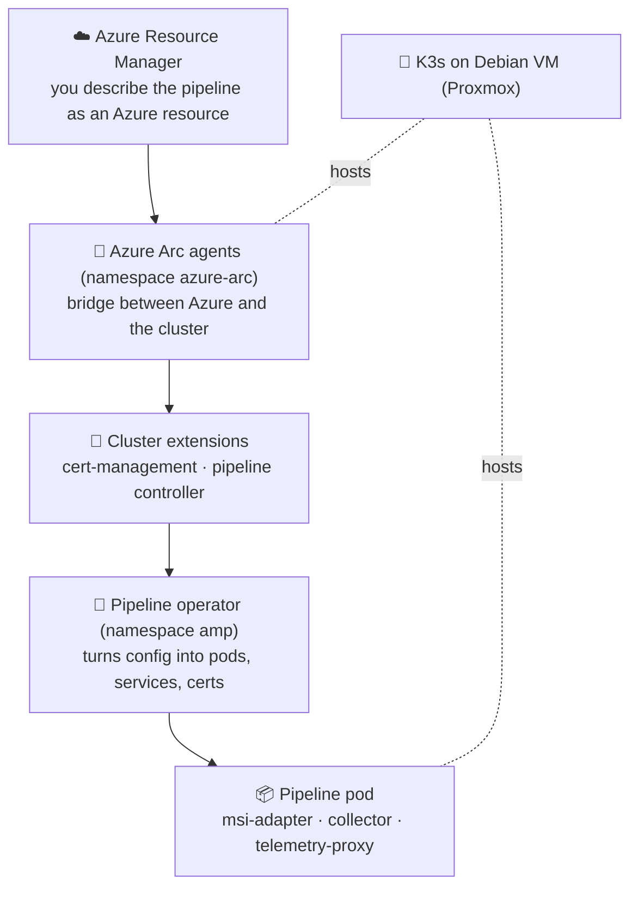
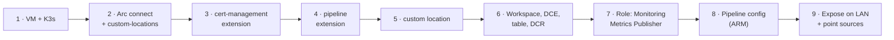
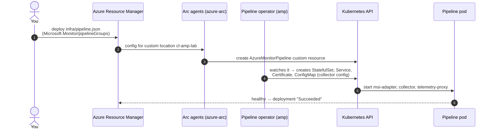
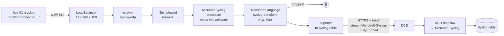
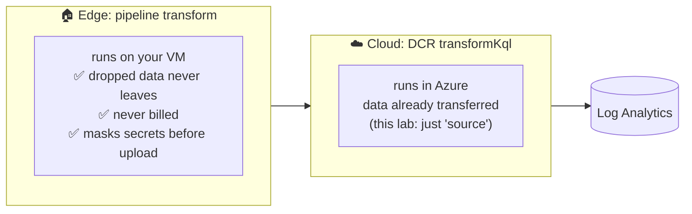
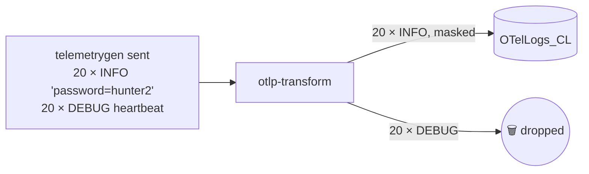
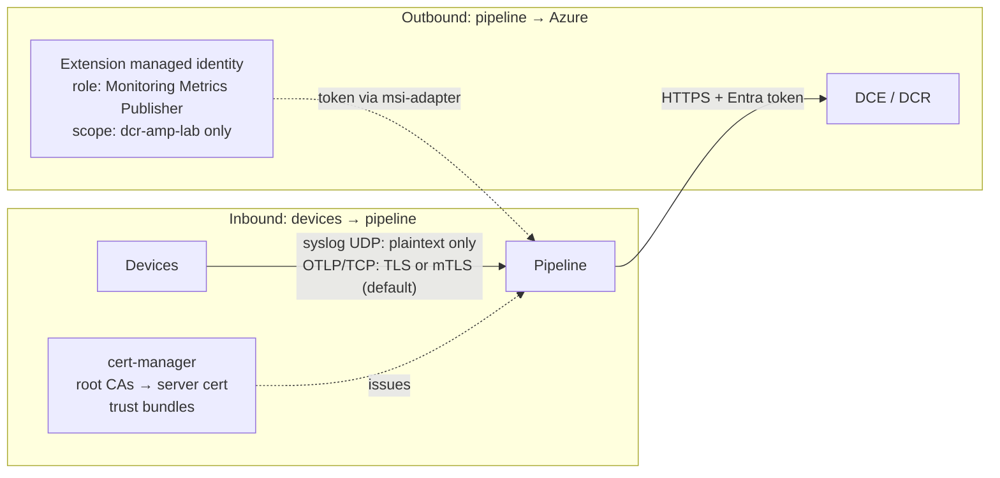
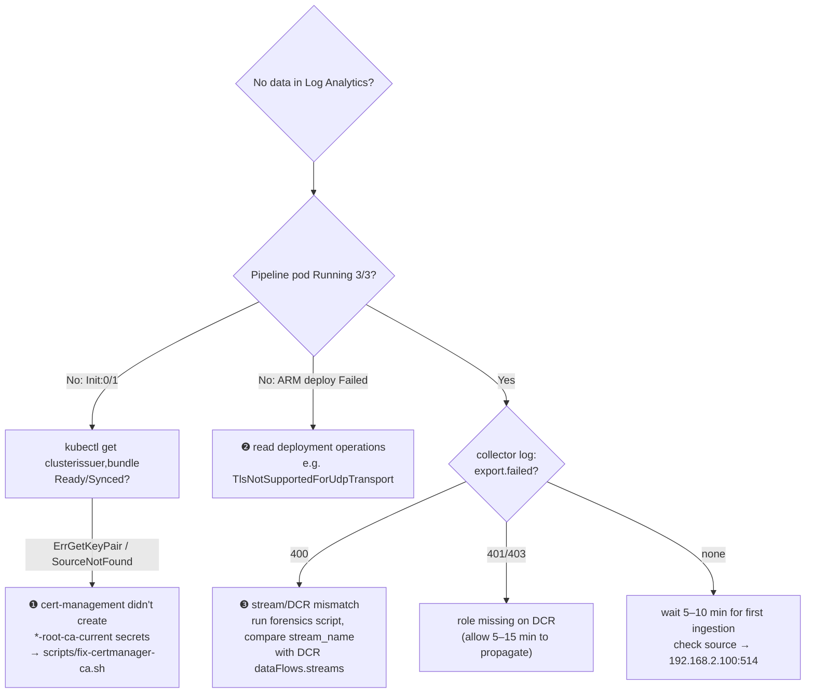

# Learning guide: Azure Monitor pipeline, explained with this lab

This guide explains **how the lab is built** and **how data moves through it**, using diagrams and
real output captured from the running lab (25 Sep 2026). Diagrams are Mermaid and render on GitHub.

- [1. The big picture](#1-the-big-picture)
- [2. The layers: who does what](#2-the-layers-who-does-what)
- [3. How the setup was built (step by step)](#3-how-the-setup-was-built-step-by-step)
- [4. How configuration reaches the edge](#4-how-configuration-reaches-the-edge)
- [5. Life of a log record](#5-life-of-a-log-record)
- [6. Transformations: edge vs. cloud](#6-transformations-edge-vs-cloud)
- [7. Security: identity and certificates](#7-security-identity-and-certificates)
- [8. Seeing it work: real output](#8-seeing-it-work-real-output)
- [9. Where to look in the Azure portal](#9-where-to-look-in-the-azure-portal)
- [10. Troubleshooting map (what broke in this lab)](#10-troubleshooting-map-what-broke-in-this-lab)
- [11. Self-test questions](#11-self-test-questions)

---

## 1. The big picture

Azure Monitor pipeline is a **collector that runs in your own network**. Devices send it logs,
it **filters and reshapes** them locally, and then forwards only what you want to Log Analytics.



**Key idea:** only **outbound HTTPS** leaves your network. Nothing in Azure connects *into* your homelab.

### Why not just an agent?

| | Azure Monitor **Agent** (AMA) | Azure Monitor **pipeline** |
|---|---|---|
| Runs on | every machine | once, centrally (Kubernetes) |
| Collects from | the machine it's on | anything that can **send** syslog/OTLP (switches, firewalls, appliances) |
| Filtering before cloud | limited | full KQL at the edge |
| Survives internet outage | small cache | persistent buffer, up to 48 h |

---

## 2. The layers: who does what



| Layer | What it is in this lab | Your responsibility? |
|---|---|---|
| Hardware / VM | Proxmox VM 110, Debian 13 | ✅ yours |
| Kubernetes | K3s v1.33 (single node) | ✅ yours (updates, capacity) |
| Arc | `arc-amp-lab`, agent 1.37.3 | Microsoft ships it, you keep it connected |
| Extensions | cert-management 1.2.0, pipeline 1.7.0 | Microsoft (auto-upgrade minor) |
| Pipeline config | `amp-lab-pipeline` ARM resource | ✅ yours (it's in `infra/pipeline.json`) |

**What Kubernetes gives the pipeline:** restart on crash, a stable address (Service), certificate
automation (cert-manager), persistent storage for buffering, and scale-out (more replicas).

---

## 3. How the setup was built (step by step)



| Step | Command (simplified) | What you learn |
|---|---|---|
| 1 | `curl -sfL https://get.k3s.io \| INSTALL_K3S_CHANNEL=v1.33 sh -` | K3s is a supported distro |
| 2 | `az connectedk8s connect -n arc-amp-lab -g rg-amp-lab` | The cluster becomes an Azure resource |
| 2 | `az connectedk8s enable-features --features custom-locations` | Lets Azure *target* the cluster |
| 3 | `az k8s-extension create --extension-type microsoft.certmanagement` | TLS plumbing; **required first** |
| 4 | `az k8s-extension create --extension-type microsoft.monitor.pipelinecontroller --release-namespace amp` | Installs the operator |
| 5 | `az customlocation create --namespace amp ...` | "A place in Azure" = namespace `amp` on your cluster |
| 6 | workspace, `az monitor data-collection endpoint create`, `infra/dcr.json` | The cloud-side landing zone |
| 7 | `az role assignment create --role "Monitoring Metrics Publisher" --scope <DCR>` | The pipeline may write to *this* DCR only |
| 8 | `az deployment group create --template-file infra/pipeline.json` | The pipeline itself |
| 9 | `kubectl apply -f k8s/expose.yaml`, rsyslog drop-in on hosts | Get data in |

Real output after the build:

```text
$ az resource list -g rg-amp-lab -o table
Name
----------------
law-amp-lab          ← Log Analytics workspace
arc-amp-lab          ← Arc-enabled K3s cluster
cl-amp-lab           ← Custom location
dce-amp-lab          ← Data Collection Endpoint
dcr-amp-lab          ← Data Collection Rule
amp-lab-pipeline     ← the pipeline (Microsoft.Monitor/pipelineGroups)

$ az k8s-extension list ... -o table
Name                               State      Train    Version
amp-extension                      Succeeded  Preview  1.7.0
azure-cert-management              Succeeded  stable   1.2.0
microsoft.extensiondiagnostics-v0  Succeeded  stable   0.168.0
```

---

## 4. How configuration reaches the edge

You never `kubectl apply` the pipeline. You deploy an **Azure resource**, and it flows down.



That's why the ARM deployment stays `Running` until the pod is healthy.

Real result inside the cluster:

```text
$ kubectl -n amp get pods,svc
pod/amp-extension-pipeline-operator-controller-manager-...   2/2  Running   ← the operator
pod/amp-lab-pipeline-statefulset-0                            3/3  Running   ← the pipeline
service/amp-lab-pipeline-service   ClusterIP     10.43.223.156   514/UDP,4317/TCP   ← created by operator
service/amp-lab-pipeline-lan       LoadBalancer  192.168.2.100   514/UDP,4317/TCP   ← added by us (k8s/expose.yaml)

$ containers in the pipeline pod
init:      msi-adapter        → fetches Azure tokens for the managed identity
container: collector          → receives, transforms, exports (OpenTelemetry-based)
container: telemetry-proxy    → the pipeline's own health telemetry
```

---

## 5. Life of a log record

Follow one Proxmox syslog line from the host into a KQL result.



This chain isn't guessed: it's the **real rendered config** from the forensics script:

```text
connections:
  syslog-udp                       → syslog-udp-filterAllowedFormats
  syslog-udp-filterAllowedFormats  → syslog/ms-syslog-attributes
  syslog/ms-syslog-attributes      → syslog/ms-syslog-kql
  syslog/ms-syslog-kql             → syslog/syslog-transform      ← our KQL
  syslog/syslog-transform          → syslog/to-syslog-table       ← exporter
  otlp-grpc                        → otlp/otlp-transform          ← our KQL
  otlp/otlp-transform              → otlp/to-otel-table
```

And the resulting row in Log Analytics:

```text
TimeGenerated                Computer  Facility  SeverityLevel  ProcessName  SyslogMessage
2026-09-25T07:27:41.471577Z  host01    mail      info           postfix      connect to hotmail-com.olc.protection.outlook.com[52.101.19…
```

The raw text line was turned into proper columns (`Computer`, `Facility`, `ProcessName` and so on) by the
`MicrosoftSyslog` processor, **before** leaving your network.

---

## 6. Transformations: edge vs. cloud

There are **two** places you can run KQL:



The lab's edge transformations:

```kusto
// Syslog: drop debug and noisy processes
source
| where SeverityLevel != 'debug'
| where not(ProcessName in ('pvestatd','CRON','systemd-timesyncd'))

// OTLP: drop DEBUG, mask a secret
source
| where SeverityText != 'DEBUG'
| extend Body = replace_string(Body, 'password=hunter2', 'password=***')
```

**What went in vs. what came out (OTLP test):**



```text
OTelLogs_CL | summarize Records=count() by SeverityText, Body
Body                                   SeverityText  Records
user login ok user=alice password=***  INFO          20        ← 0 DEBUG rows, secret masked
```

The supported KQL is a **subset**: `where`, `extend`, `project*`, `parse_json`, `replace_string`, `extract`,
`iif/case`, and `summarize` with `count/sum/avg/min/max/bin` (aggregation needs a `Batch` processor).

---

## 7. Security: identity and certificates



- **No secrets on the edge.** The pipeline authenticates with the extension's **managed identity**. Its
  only permission is *publish to this one DCR*.
- **Certificates protect the inbound side.** Every receiver defaults to **mutual TLS**. UDP syslog can't do
  TLS (Azure rejects it), and in this lab OTLP was set to `mode: disabled` to keep it simple.
- In production you'd use syslog over **TCP+TLS** or OTLP with TLS, often behind a **gateway** (Traefik) for
  clients outside the cluster.

Healthy certificate state (after the workaround, see §10):

```text
clusterissuer/arc-amp-root-ca-cluster-issuer         True
clusterissuer/arc-amp-client-root-ca-cluster-issuer  True
bundle/arc-amp-trust-bundle                          True  Synced
bundle/arc-amp-client-trust-bundle                   True  Synced
```

---

## 8. Seeing it work: real output

Run these in **Log Analytics → Logs** (all are in `docs/queries.kql`).

**Which hosts are sending?**
```text
Syslog | summarize Records=count() by Computer
host01   700
host02   489
```

**Did the filter work?** (should be 0)
```text
Syslog | where SeverityLevel=='debug' or ProcessName in ('pvestatd','CRON','systemd-timesyncd') | count
0
```

**Who is noisiest?** This is your next filter candidate:
```text
Syslog | summarize Records=count() by ProcessName | top 6 by Records
postfix         880   ████████████████████████████████████  74%
systemd         218   █████████
pmxcfs           26   █
sshd-session     15
systemd-logind   15
sudo             15
```

**What does it cost?** (`Usage` table, last 24 h)
```text
DataType     MB
Heartbeat    2.183   ← Arc/agent heartbeats
Syslog       0.211
OTelLogs_CL  0.001
```

Try it: add `'postfix'` to the syslog filter, redeploy `infra/pipeline.json`, and watch the Syslog MB drop.

---

## 9. Where to look in the Azure portal

Open **Resource groups → `rg-amp-lab`**, then follow the path data takes:

| # | Portal location | What to look at |
|---|---|---|
| 1 | **Azure Arc → Kubernetes clusters → `arc-amp-lab`** | *Overview:* status Connected, distro k3s. *Extensions:* both extensions `Succeeded`. |
| 2 | `arc-amp-lab` → **Services and ingresses** / **Workloads** | The `amp-lab-pipeline-service` and the pod, as seen from Azure (uses cluster-connect). |
| 3 | **Azure Arc → Custom locations → `cl-amp-lab`** | It maps to namespace `amp` and lists the pipeline extension. |
| 4 | **Monitor → Azure Monitor pipelines → `amp-lab-pipeline`** | Receivers, processors and exporters. The **JSON view** matches `infra/pipeline.json`. |
| 5 | **Monitor → Data Collection Rules → `dcr-amp-lab`** | *JSON view:* `immutableId`, dataFlows (`Microsoft-Syslog-FullyFormed → Microsoft-Syslog`). *Access control:* the extension identity has Monitoring Metrics Publisher. |
| 6 | **Monitor → Data Collection Endpoints → `dce-amp-lab`** | The *Logs Ingestion* URL the pipeline posts to. |
| 7 | **Log Analytics workspaces → `law-amp-lab` → Logs** | Run the queries from §8. *Tables:* `Syslog`, `OTelLogs_CL`. *Usage and estimated costs:* daily cap 1 GB. |

> Tip: open the pipeline's JSON view and `infra/pipeline.json` side by side. They're the same thing:
> the portal is just a view over the ARM resource.

---

## 10. Troubleshooting map (what broke in this lab)



| # | Symptom | Root cause | Fix |
|---|---|---|---|
| ❶ | Pipeline pod stuck at `Init:0/1`, FailedMount on trust bundle and TLS secret | cert-management extension never created `arc-amp-*-root-ca-current` secrets or their rotation label | `scripts/fix-certmanager-ca.sh` (lab only, doesn't rotate) |
| ❷ | ARM deployment `Failed` | TLS setting on a **UDP** syslog receiver | Remove `tlsConfiguration` from UDP receivers |
| ❸ | `export.failed … 400 Bad Request` every batch | DCR input stream was `Microsoft-Syslog`; exporter sends `Microsoft-Syslog-FullyFormed` | DCR dataflow `streams: ["Microsoft-Syslog-FullyFormed"]`, then wait for propagation |

Forensics script (ships with extension ≥ 1.7.0):
```bash
kubectl -n amp get configmap azure-monitor-pipeline-forensics \
  -o go-template='{{ index .data "azure-monitor-pipeline-forensics.sh" }}' > f.sh
bash f.sh -n amp -p amp-lab-pipeline      # → azure-monitor-pipeline-forensics.zip
```

---

## 11. Self-test questions

1. Why can the pipeline send to Azure without any secret stored on the VM?
2. A firewall appliance sends 10 GB/day of logs, 90 % of it health-check noise. Where do you filter, and why there?
3. What's the difference between the pipeline's `TransformLanguage` processor and the DCR's `transformKql`?
4. Why does the deployment of `infra/pipeline.json` take minutes and not seconds?
5. Your internet is down for 6 hours. What do you need configured so no logs are lost?
6. Why did the syslog receiver refuse a TLS configuration?

<details><summary>Answers</summary>

1. The extension has a **managed identity**. The `msi-adapter` gets Entra tokens through Arc, and the identity only has *Monitoring Metrics Publisher* on the DCR.
2. At the **edge** (pipeline transform): the data never leaves your network and is never billed.
3. The pipeline transform runs **on your cluster before upload**. The DCR transform runs **in Azure after upload**.
4. ARM waits until the config has flowed via Arc to the operator and the **pod is healthy** (§4).
5. **Persistent storage**: a ReadWriteMany persistent volume plus `persistence` in the config, which holds up to 48 h and backfills automatically.
6. It uses **UDP**, and TLS needs TCP. Use syslog over TCP for encrypted ingestion.
</details>
