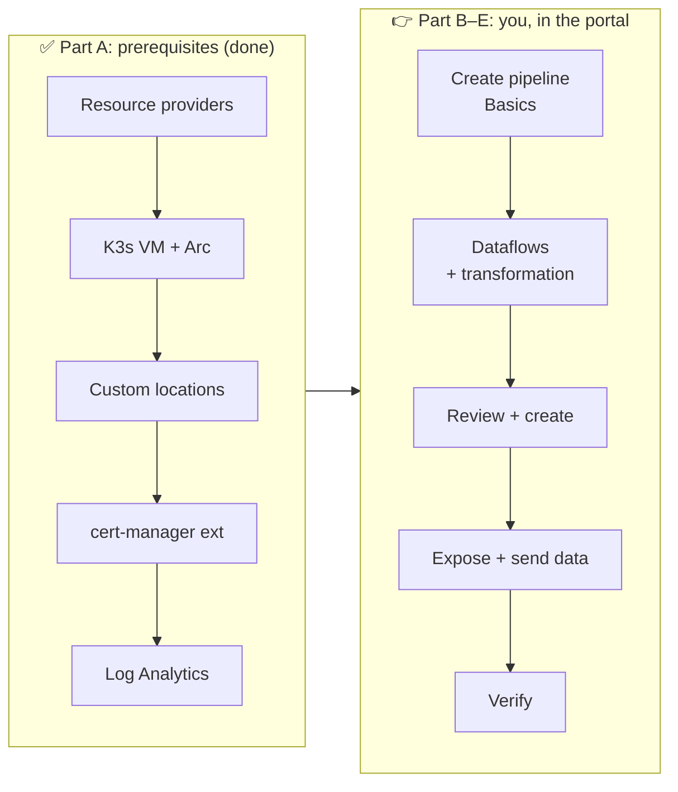
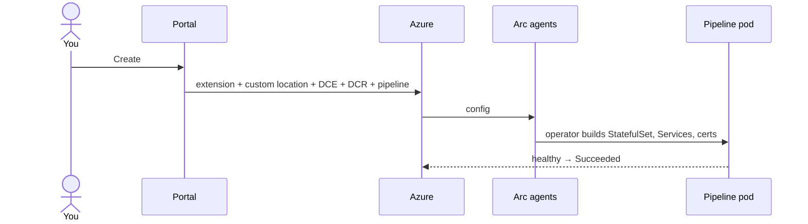
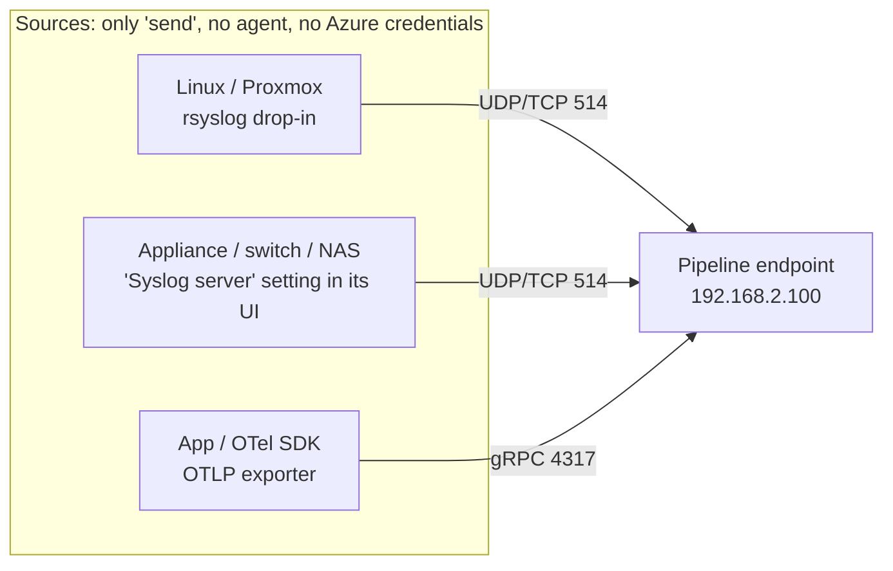
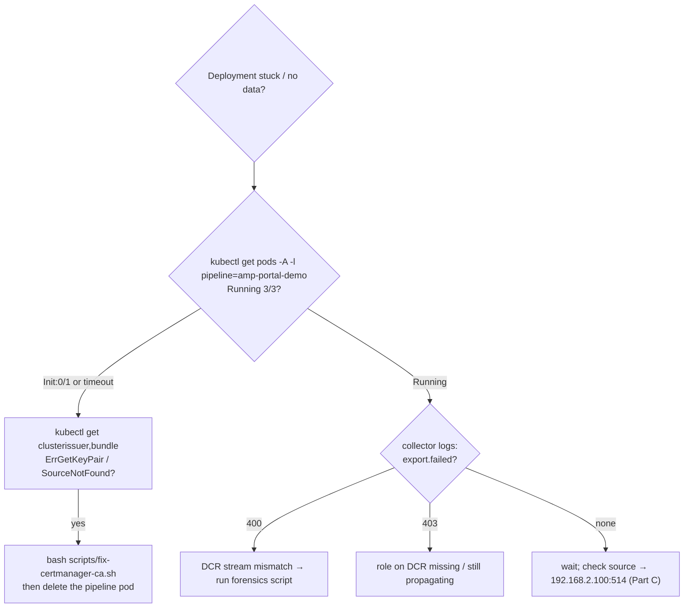

# Configure Azure Monitor pipeline in the Azure portal: step-by-step

This guide walks you through configuring **Azure Monitor pipeline with the Azure portal** on the
homelab's Arc-enabled K3s cluster. It follows the official docs:

- [Configure Azure Monitor pipeline](https://learn.microsoft.com/en-us/azure/azure-monitor/data-collection/pipeline-configure) (prerequisites, cert-manager, verification)
- [Configure Azure Monitor pipeline with the Azure portal](https://learn.microsoft.com/en-us/azure/azure-monitor/data-collection/pipeline-configure-portal)

> **Status (checked 1 Oct 2026):** all prerequisites in Part A are **already completed** in the homelab.
> You start at **Part B**. Lab-specific additions that aren't in the docs are marked 🏠.



---

## Part A: Prerequisites (completed ✅)

| # | Prerequisite (official docs) | Homelab value | Status |
|---|---|---|---|
| A1 | Resource providers `Microsoft.Insights`, `Microsoft.Monitor` registered | Also registered: `Microsoft.Kubernetes`, `Microsoft.KubernetesConfiguration`, `Microsoft.ExtendedLocation`, `Microsoft.OperationalInsights` | ✅ Registered |
| A2 | Arc-enabled Kubernetes cluster with an external IP | `arc-amp-lab`, K3s `v1.33.13+k3s2` (supported distro), agent 1.37.3, VM 110 `amp-lab-k3s` at **192.168.2.100** (Proxmox host01) | ✅ Connected |
| A3 | Custom locations enabled on the cluster | `customLocations.enabled: true` (cluster-connect also enabled) | ✅ Enabled |
| A4 | Certificate Manager extension installed (step 2 of the setup flow) | `azure-cert-management`, type `microsoft.certmanagement`, version 1.2.0 | ✅ Succeeded |
| A5 | Log Analytics workspace | `law-amp-lab` in `rg-amp-lab` (West Europe), daily cap 1 GB, retention 30 days | ✅ Created |
| A6 | (Optional) custom table | Not needed: we use the built-in `Syslog` table | n/a |
| 🏠 | Syslog sources | Proxmox host01 and host02 forward `*.info` + auth via `/etc/rsyslog.d/90-amp-lab.conf` → `192.168.2.100:514/udp`; test script `amp-send-test` on the VM | ✅ Ready |
| 🏠 | Clean slate | Previous CLI-built pipeline, pipeline extension, custom location, DCR, DCE and the `amp` namespace were removed; nothing listens on 514/4317 | ✅ Reset |

**Not pre-created on purpose:** the portal flow creates the **pipeline extension, custom location, DCR and
DCE** for you. That's the part you're learning.

**Where to check in the portal:**
- *Azure Arc → Kubernetes clusters → `arc-amp-lab`* → Overview: **Connected**.
- *Extensions* tab: only `azure-cert-management` is listed (plus a system diagnostics extension, if present).

---

## Part B: Create the pipeline (portal)

### B1. Start the creation flow
Choose **one** of these:
- Portal search **"Azure Monitor pipelines"** → **+ Create**, or
- **Azure Arc → Kubernetes clusters → `arc-amp-lab` → Extensions → + Add → Azure Monitor pipeline extension**.

### B2. Basics tab

| Field | Enter | Why |
|---|---|---|
| Instance name | `amp-portal-demo` | Must be unique in the subscription; also becomes the pod/service prefix |
| Subscription | `ME-MngEnv224247-rutgerpels-1` | |
| Resource group | `rg-amp-lab` | Keeps teardown to one command |
| Cluster name | `arc-amp-lab` | |
| Custom location | let the portal create it (`azure-monitor-arc-amp-lab`) | Maps an Azure "location" to a namespace on your cluster. **Note:** the portal maps it to namespace **`azure-monitor-ns`**, not a namespace with the custom location's name |
| Enable transport security (TLS) | **Unchecked** | UDP syslog can't use TLS; keeps the demo simple |
| Require client authentication within cluster | **Unchecked** | mTLS isn't needed for the demo |

→ **Next: Dataflows**

### B3. Dataflows tab → edit **`default-syslog`**

The portal pre-creates a `default-syslog` dataflow on port 514. **Edit it** instead of using *+ Add dataflow*;
a second dataflow on 514 is rejected with "port already in use".

| Field | Enter |
|---|---|
| Name | `proxmox-syslog` |
| Source type | `Syslog` |
| Port | `514` |
| Protocol | `UDP` |
| Format | both `5424` and `3164` (Proxmox's rsyslog sends 5424; `logger` can send either) |
| Collect messages with PRI header | enabled (default) |
| Log Analytics workspace | `law-amp-lab`. ⚠️ **Re-check this every time you re-run the wizard**: on retries it can silently fall back to `DefaultWorkspace-<sub>-WEU` |
| Table | `Syslog` |
| Table name | `Syslog` (must match Table) |

**Add Data Transformations** → template **Custom**, paste:

```kusto
source
| where SeverityLevel != 'debug'
| where ProcessName !in ('pvestatd', 'CRON', 'systemd-timesyncd', 'postfix')
```

Select **Check KQL syntax** and make sure it passes (it also validates against the `Syslog` schema), then **Save**.

> Optional second dataflow for OTLP (preview): source type `OTLP`, port `4317`, custom table, only
> `TimeGenerated`, `SeverityText` and `Body` are available in the portal. Skip it for a first run.

### B4. Review + create
Select **Create**. Deployment takes **several minutes**: Azure installs the pipeline extension, creates the
custom location, DCE, DCR and the pipeline instance, then waits for the pod to be healthy.

#### ⚠️ B4a. If Create fails with `PreflightValidationError … Invalid Format of Cluster Extension IDs`
Observed 1–2 Oct 2026 from **both** entry points: the portal builds the custom location's
`clusterExtensionIds` **without the extension name** (`…/extensions/`). Fix it in the template:

1. On **Review + create** → **Download a template for automation** → **Deploy** → **Edit parameters**.
2. Replace `clusterExtensionIds` with the complete ID, ending in the value of `pipelineExtensionName`
   (portal default `azmon-pipeline-extension`):
   ```json
   "clusterExtensionIds": { "value": [
     "/subscriptions/<sub-id>/resourceGroups/rg-amp-lab/providers/Microsoft.Kubernetes/connectedClusters/arc-amp-lab/providers/Microsoft.KubernetesConfiguration/extensions/azmon-pipeline-extension"
   ]}
   ```
3. Check it carefully. Each of these produces a *different* preflight error:

   | Mistake | Error you'll see |
   |---|---|
   | Name missing (`…/extensions/`) | `Invalid Format of Cluster Extension IDs` |
   | Trailing slash (`…/azmon-pipeline-extension/`) | `Invalid Format of Cluster Extension IDs` |
   | A space from a line-wrapped copy (`connectedClust ers`) | `Host Resource of Cluster Extension IDs … do not match HostResourceID` |

   The ID must start with exactly the same text as the `clusterId` parameter.
4. Also re-check the workspace in `tableInfo` (`…/workspaces/law-amp-lab`), then **Review + create**.

Don't pre-create the extension/custom location with CLI under *different* names: the template would then
install a second pipeline extension.



> ⚠️ **Known issue (reproduced 4 out of 4 times)**: with cert-management 1.2.0 + pipeline 1.7.0, the
> `arc-amp-*-root-ca-current` secrets aren't created. The pipeline pod can even reach 3/3 Running, but its
> TLS certificate stays pending, and the deployment runs for 30+ minutes or times out. You don't have to wait:
> check after about 5 minutes with `kubectl get clusterissuer,bundle | grep arc-amp`. If you see `False` or
> `SourceNotFound`, apply the **Part F** workaround. The deployment then finishes on its own.

---

## Part C: Make the pipeline reachable from the LAN 🏠

The operator creates **ClusterIP** services, which are only reachable inside the cluster. The docs use a Traefik gateway
with a cloud LoadBalancer. On a homelab K3s, the built-in ServiceLB is simpler. Run from a machine with the kubeconfig:

```bash
export KUBECONFIG=~/.kube/amp-lab.yaml      # kubeconfig for the lab cluster
NS=$(kubectl get pods -A -l pipeline=amp-portal-demo -o jsonpath='{.items[0].metadata.namespace}')
kubectl -n $NS apply -f - <<EOF
apiVersion: v1
kind: Service
metadata: {name: amp-portal-demo-lan}
spec:
  type: LoadBalancer
  selector: {pipeline: amp-portal-demo}
  ports:
  - {name: syslog-udp, port: 514, targetPort: 514, protocol: UDP}
EOF
kubectl -n $NS get svc amp-portal-demo-lan     # EXTERNAL-IP should be 192.168.2.100
```

The Proxmox hosts are already pointed at `192.168.2.100:514/udp`, so data starts flowing straight away.

### C2. Configure clients (sources) 🏠

> **Not covered in the official pipeline docs.** They only say *"point your data sources to the pipeline
> endpoint"* ([configure-cli workflow](https://learn.microsoft.com/en-us/azure/azure-monitor/data-collection/pipeline-configure-cli)),
> *"configure your external clients to connect to the right gateway IP and port"* ([configure, step 5](https://learn.microsoft.com/en-us/azure/azure-monitor/data-collection/pipeline-configure)),
> and *"point the new client at `$GATEWAY_IP:514`"* ([gateway → Add a new client](https://learn.microsoft.com/en-us/azure/azure-monitor/data-collection/pipeline-kubernetes-gateway#add-a-new-client-to-an-existing-receiver)).
> The client side is standard syslog/OTLP, so configure it the way each OS or device normally does.
> The examples below come from the [rsyslog `omfwd` docs](https://www.rsyslog.com/doc/configuration/modules/omfwd.html)
> and were validated in this lab (Proxmox VE 9 / Debian 13, rsyslog 8.2504).



**What each source needs to match from the dataflow (B3):**

| Dataflow setting | Client must use |
|---|---|
| Port / Protocol | the same port and UDP/TCP (here **514/UDP**) |
| Format `5424` | RFC 5424 output. rsyslog: `template="RSYSLOG_SyslogProtocol23Format"` |
| Format `3164` | classic BSD format (rsyslog default `RSYSLOG_ForwardFormat`, most appliances) |
| Collect messages with PRI header | messages start with `<PRI>`; nearly all senders do this |

**a) Linux / Proxmox: rsyslog, UDP (what this lab uses)**

`/etc/rsyslog.d/90-amp-lab.conf` on **each** host (not synced by the Proxmox cluster):
```text
# Forward to Azure Monitor pipeline (delete this file + restart rsyslog to undo)
*.info;auth,authpriv.* action(type="omfwd" target="192.168.2.100" port="514" protocol="udp"
                              template="RSYSLOG_SyslogProtocol23Format")
```
```bash
rsyslogd -N1 && systemctl restart rsyslog        # validate, then apply
logger -p auth.notice -t amp-demo "hello from $(hostname)"
```
- `*.info;auth,authpriv.*` = everything at info and above, plus all auth messages. Narrow it to reduce
  volume, or let the pipeline transformation filter centrally (B3).
- Proxmox VE 9 ships rsyslog and journald forwards to it by default, so nothing else is needed.

**b) Linux: rsyslog over TCP with a disk-assisted queue (recommended beyond a lab)**

UDP is fire-and-forget: messages sent while the pipeline restarts are lost (seen in this lab). TCP plus a
queue buffers on the host. Requires a **TCP** dataflow on the pipeline side.
```text
*.info;auth,authpriv.* action(type="omfwd" target="192.168.2.100" port="514" protocol="tcp"
    template="RSYSLOG_SyslogProtocol23Format" TCP_Framing="octet-counted"
    queue.type="LinkedList" queue.size="10000" queue.filename="amp_fwd" queue.saveOnShutdown="on"
    action.resumeRetryCount="-1" action.resumeInterval="10")
```
> ✅ This config passes rsyslog validation on host01; it wasn't applied in this lab. For encryption, add `StreamDriver="gtls"`,
> `StreamDriverMode="1"` and CA settings, and enable TLS on the pipeline receiver plus a gateway (see the
> [TLS docs](https://learn.microsoft.com/en-us/azure/azure-monitor/data-collection/pipeline-tls)).

**c) Linux: syslog-ng**
```text
destination d_amp { syslog("192.168.2.100" transport("udp") port(514)); };   # RFC 5424
log { source(s_src); destination(d_amp); };
```

**d) Appliances (Synology, UniFi, firewalls, switches)**

Set *Remote syslog server* = `192.168.2.100`, port `514`, protocol `UDP` (or TCP if you created a TCP dataflow),
format **BSD/3164** or **IETF/5424** to match the dataflow. No software install.
> 🏠 In this lab the NAS deliberately sends **no** syslog (file/connection logs contain personal data);
> it's monitored through SNMP metrics instead (see `docs/GRAFANA.md`).

**e) OpenTelemetry apps (OTLP, preview)**
Set `OTEL_EXPORTER_OTLP_ENDPOINT=http://<pipeline-ip>:4317` and `OTEL_EXPORTER_OTLP_PROTOCOL=grpc`
(needs an OTLP dataflow; in-cluster clients can use `<pipeline>-service.<namespace>.svc:4317`).

**Check connectivity from a source** (from the [troubleshoot article](https://learn.microsoft.com/en-us/azure/azure-monitor/data-collection/pipeline-troubleshoot)):
```bash
nc -zv 192.168.2.100 514          # TCP receivers only; UDP can't be "connected" to
logger -n 192.168.2.100 -P 514 -d --rfc5424 -t amp-demo "udp test"   # UDP: send, then check E3
grpcurl -plaintext 192.168.2.100:4317 list                            # OTLP
```
On the pipeline side, confirm packets arrive: `sudo tcpdump -ni any udp port 514` on VM 110.

---

## Part D: Send test data

From the VM (`ssh amplab@192.168.2.100`):

```bash
amp-send-test 192.168.2.100     # 5 × INFO (kept) + 5 × DEBUG (should be dropped by your transform)
```

Or from a Proxmox host: `logger -t amp-demo "hello from $(hostname)"`.

---

## Part E: Verify (official checks + lab checks)

Each Log Analytics check below comes in two forms: the **KQL** and an equivalent **prompt** for the
**Azure Copilot Observability Agent** (preview). This shows the customer that data ingested through the
pipeline is immediately usable by agentic tooling, because once it lands in a Log Analytics workspace it's
ordinary `Syslog` data.

> **How to open the agent:** *law-amp-lab → Logs → **Observability Agent*** button. The chat is scoped to
> the workspace. If a query is already open in Logs, the agent picks it up. You can ask it to
> *"show the KQL you used"* to compare with the queries below.
> **Notes:** preview feature; it runs with **your** RBAC permissions; access is controlled through Azure Copilot
> settings. Usage is billed in Azure Agent Credits (a deep investigation is capped at 300 AACs), so
> stick to chat prompts for the demo. The agent's answers are generated, so treat the KQL as the ground truth.

**E1. Cluster components:** *Arc cluster `arc-amp-lab` → Kubernetes resources → Services and ingresses*.
Expect `amp-portal-demo-service` in namespace `azure-monitor-ns`. The docs also list
`amp-portal-demo-external-service`; it was **not** created in this lab (UDP syslog, TLS off). Our own
`amp-portal-demo-lan` from Part C takes that role.

**E2. Heartbeat** (every minute; `OSMajorVersion` = pipeline name). In *law-amp-lab → Logs*:

| KQL | 🤖 Agent prompt |
|---|---|
| `Heartbeat`<br>`\| where OSMajorVersion == "amp-portal-demo"`<br>`\| summarize LastBeat = max(TimeGenerated) by Computer, OSMajorVersion` | *"Is the Azure Monitor pipeline `amp-portal-demo` sending heartbeats to this workspace? When was the last one?"* |
> ⚠️ In this lab (pipeline 1.7.0) **no pipeline heartbeat appeared** in either workspace, while data did
> arrive. Treat E3/E4 as the real proof; don't treat a missing heartbeat alone as a failure.

**E2b. DCR metrics (portal view of the edge → cloud hop):** *DCR → Monitoring → Metrics*, using
`Rows Received` and `Rows Dropped`. Rows received but nothing in the table? Check the DCR's **destination
workspace** (`destinations.logAnalytics[].workspaceResourceId` in the JSON view).

**E3. Data arrived** (allow 5–10 minutes for first ingestion):

| KQL | 🤖 Agent prompt |
|---|---|
| `Syslog`<br>`\| where TimeGenerated > ago(30m)`<br>`\| summarize Records = count() by Computer, ProcessName`<br>`\| order by Records desc` | *"Which hosts sent syslog to this workspace in the last 30 minutes, and which processes are the most active per host?"* |

**E4. Transformation works** (both should return **0**):

| KQL | 🤖 Agent prompt |
|---|---|
| `Syslog \| where TimeGenerated > ago(30m) \| where SeverityLevel == 'debug' \| count` | *"Did any debug-level syslog messages arrive in the last 30 minutes?"* |
| `Syslog \| where TimeGenerated > ago(30m) \| where ProcessName == 'postfix' \| count` | *"Are there any postfix mail log entries from the last 30 minutes? I expect none because they're filtered at the edge."* |

**E5. See what the portal built for you:** open *Monitor → Data Collection Rules* and find the new DCR
(named `Aep-amp-portal-demo-<random>`, as is the DCE). In its **JSON view**, look at `dataFlows` (the portal
uses `Microsoft-Syslog-FullyFormed` as both input and output stream; the CLI build used output `Microsoft-Syslog`; both land in `Syslog`), then
check *Access control* (the extension's identity has **Monitoring Metrics Publisher**). Compare it with
`infra/dcr.json` from the CLI build.


**E6. Beyond verification: agentic exploration (demo storyline)**

These show what the customer gets on top of the pipeline: natural-language analysis of edge data.

| Goal | KQL | 🤖 Agent prompt |
|---|---|---|
| Overview | `Syslog \| where TimeGenerated > ago(24h) \| summarize count() by Computer, SeverityLevel` | *"Summarize the syslog activity from my Proxmox hosts over the last 24 hours. Anything unusual?"* |
| Trend | `Syslog \| where TimeGenerated > ago(24h) \| summarize count() by bin(TimeGenerated, 1h), Computer \| render timechart` | *"Chart the syslog volume per host per hour for the last day."* |
| Security | `Syslog \| where TimeGenerated > ago(24h) \| where Facility in ('auth','authpriv') or ProcessName in ('sshd','sshd-session','sudo') \| summarize count() by Computer, ProcessName` | *"Show authentication and sudo activity on my hosts in the last 24 hours. Were there any failed logins?"* |
| Errors | `Syslog \| where TimeGenerated > ago(24h) \| where SeverityLevel in ('warning','err','error','crit','critical') \| summarize count() by Computer, ProcessName \| top 10 by count_` | *"What are the top warnings and errors from my Proxmox hosts today, and what do they mean?"* |
| Cost / tuning | `Syslog \| where TimeGenerated > ago(7d) \| summarize count() by ProcessName \| top 10 by count_` | *"Which processes generate the most syslog volume? Suggest which ones I could filter at the edge to reduce ingestion cost."* |
| Explain a query | *(open any query above first)* | *"Explain this query and its results in plain language."* |

> **Demo tip:** the *Cost / tuning* prompt closes the loop nicely. The agent suggests noisy processes,
> which you then add to the pipeline transformation (B3), showing **edge filtering + AI-assisted tuning**.
> Rehearse the prompts first: answers vary, and raw syslog can show hostnames and usernames.

---

## Part F: Troubleshooting



| Symptom | Check | Fix |
|---|---|---|
| Deployment *Running* for a long time (30+ min); pod `Init:0/1` **or** 3/3 Running with certificate `amp-portal-demo-pipeline-tls-certificate` not Ready | `kubectl get clusterissuer,bundle` → `ErrGetKeyPair: secrets "arc-amp-root-ca-current" not found` / `SourceNotFound` | `bash scripts/fix-certmanager-ca.sh`, then `kubectl -n azure-monitor-ns delete pod -l pipeline=amp-portal-demo`. Copies the root CAs to `-current` and adds the rotation label. The deployment then completes and the fix survives redeploys. **Demo-only**; seen 4 out of 4 times with cert-mgmt 1.2.0 + pipeline 1.7.0; not confirmed as a product defect. |
| Exports fail | `kubectl -n <ns> logs <pod> -c collector \| grep export.failed` | Run the forensics script: `kubectl -n <ns> get cm azure-monitor-pipeline-forensics -o go-template='{{ index .data "azure-monitor-pipeline-forensics.sh" }}' > f.sh && bash f.sh -n <ns> -p amp-portal-demo` |
| No data, no errors | `kubectl -n <ns> get svc`, then DCR metric *Rows Received* | No rows: make sure Part C's LoadBalancer exists and shows `192.168.2.100`. Rows received: check the DCR's **destination workspace** (wizard retries can switch it to `DefaultWorkspace-…`) |
| Some UDP test messages missing | right after a pod restart | Syslog over UDP has no delivery guarantee; resend after the pod has been Ready for a few minutes |
| Review + create fails: `PreflightValidationError … Cluster Extension IDs` | Portal bug, both entry points | Fix `clusterExtensionIds` in the template, see **B4a** |
| Portal pre-fills a `default-syslog` dataflow on port 514; adding a new one says "port already in use" | Dataflows tab | Edit `default-syslog` instead of adding a new dataflow |
| Operator `CrashLoopBackOff` | the doc's troubleshooting section | Cert-management extension missing (already installed here) |

---

## Part G: Clean up (back to the Part A baseline)

```bash
# Azure: remove what the portal created (keeps Arc, cert-manager, workspace)
az resource delete -g rg-amp-lab -n amp-portal-demo --resource-type Microsoft.Monitor/pipelineGroups
az customlocation delete -g rg-amp-lab -n azure-monitor-arc-amp-lab -y
az k8s-extension delete -g rg-amp-lab --cluster-name arc-amp-lab --cluster-type connectedClusters -n azmon-pipeline-extension -y
az monitor data-collection rule list -g rg-amp-lab -o table      # delete the portal-created DCR/DCE (Aep-amp-portal-demo-*)
kubectl delete ns azure-monitor-ns
kubectl -n cert-manager delete secret arc-amp-root-ca arc-amp-client-root-ca arc-amp-root-ca-current arc-amp-client-root-ca-current
# Everything:
az group delete -n rg-amp-lab -y ; ssh host01 'qm destroy 110 --purge' ; rm /etc/rsyslog.d/90-amp-lab.conf (both hosts)
```
